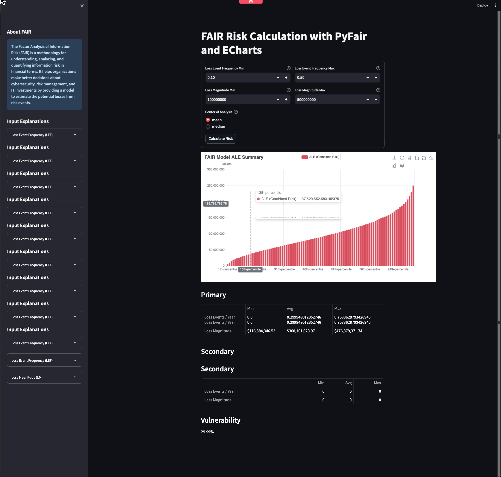

# Streamlit FAIR Calculator

The Streamlit FAIR Calculator is an interactive tool that utilizes the Factor Analysis of Information Risk (FAIR) methodology to analyze and quantify information risk in financial terms. This tool can aid organizations in making informed decisions about cybersecurity, risk management, and IT investments by estimating potential losses from risk events.



## Features

- Calculate Loss Event Frequency (LEF) and Loss Magnitude (LM) using the FAIR model.
- Simulate various risk scenarios and their financial impact.
- Visualize Annual Loss Expectancy (ALE) through interactive charts.
- Generate and view summary statistics including primary and secondary risk metrics.
- Assess vulnerability percentages based on simulation results.

## Getting Started

To get started with the Streamlit FAIR Calculator, follow these steps:

### Prerequisites

Ensure you have Python 3.6 or later installed on your system. You can download Python from the official website: [Python.org](https://www.python.org/downloads/).

### Installation

Clone the repository and set up a virtual environment:

```bash
git clone git@github.com:kenichi-shibata/streamlit-fair-calculator.git
cd streamlit-fair-calculator

# Create a virtual environment
virtualenv venv

# Activate the virtual environment
source venv/bin/activate

# Install the dependencies
pip3 install -r requirements.txt
```

## Usage

To run the Streamlit app:

``` bash
streamlit run main.py
```

Navigate to http://localhost:8501 in your web browser to view and interact with the FAIR Calculator.
Contributing


## Contributions
Contributions are welcome! Please feel free to submit pull requests with new features, improvements, or bug fixes.
License


Kenichi Shibata – 

Project Link: https://github.com/kenichi-shibata/streamlit-fair-calculator

### Acknowledgments
    * `Streamlit` - The fastest way to build and share data apps.
    * `PyFair` - Python package for quantitative risk modeling using the FAIR model.
